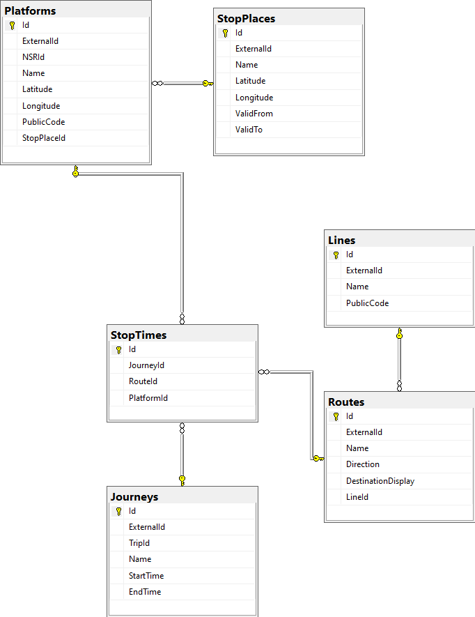

# Data model
Based on https://api.kolumbus.no/restapi/data-models.



# Entity Framework
Model  
https://learn.microsoft.com/en-us/ef/core/modeling/

Migrations  
https://learn.microsoft.com/en-us/ef/core/managing-schemas/migrations

Entity Framework Core tools reference - .NET Core CLI  
https://learn.microsoft.com/en-us/ef/core/cli/dotnet

Entity Framework Core for Beginners  
https://youtube.com/playlist?list=PLdo4fOcmZ0oX7uTkjYwvCJDG2qhcSzwZ6&si=jAa12cjE2rxx8DD4

## Create migrations for SQLite
```
dotnet ef migrations add InitialCreate --output-dir ..\ModelMigrations\SQLite --context "Model.SQLiteModelContext" --project "ModelMigrations\ModelMigrations.csproj" --startup-project "API\API.csproj"
```
### Update database
```
dotnet ef database update --context "Model.SQLiteModelContext" --project "ModelMigrations\ModelMigrations.csproj" --startup-project "API\API.csproj"
```

## Create migrations for SQL Server
```
dotnet ef migrations add InitialCreate --output-dir ..\ModelMigrations\SQLServer --context "Model.SQLServerModelContext" --project "ModelMigrations\ModelMigrations.csproj" --startup-project "API\API.csproj"
```
### Update database
```
dotnet ef database update --context "Model.SQLServerModelContext" --project "ModelMigrations\ModelMigrations.csproj" --startup-project "API\API.csproj"
```

# Tools
- [SQL Server Management Studio (SSMS)](https://learn.microsoft.com/en-us/sql/ssms/download-sql-server-management-studio-ssms)
- [Azure Data Studio](https://learn.microsoft.com/en-us/sql/azure-data-studio/download-azure-data-studio)
- [Convert Json to C# Classes Online](https://json2csharp.com)
